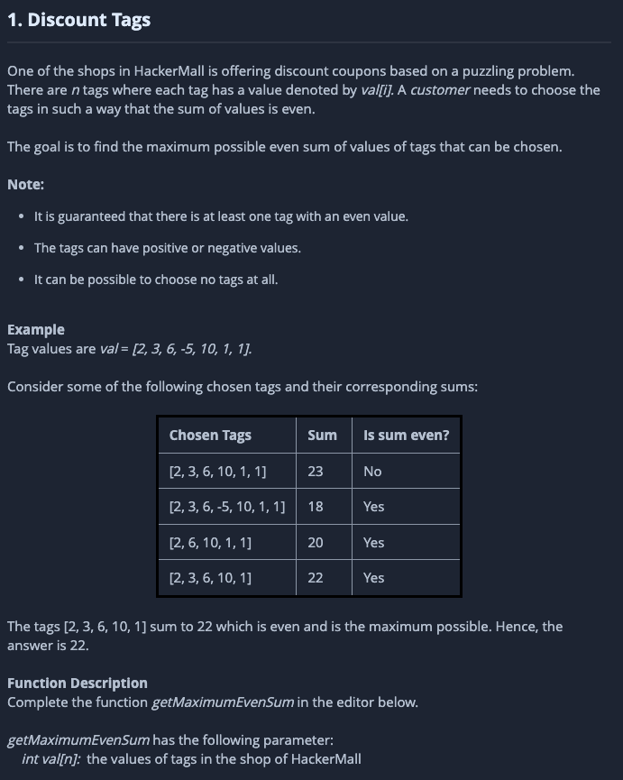
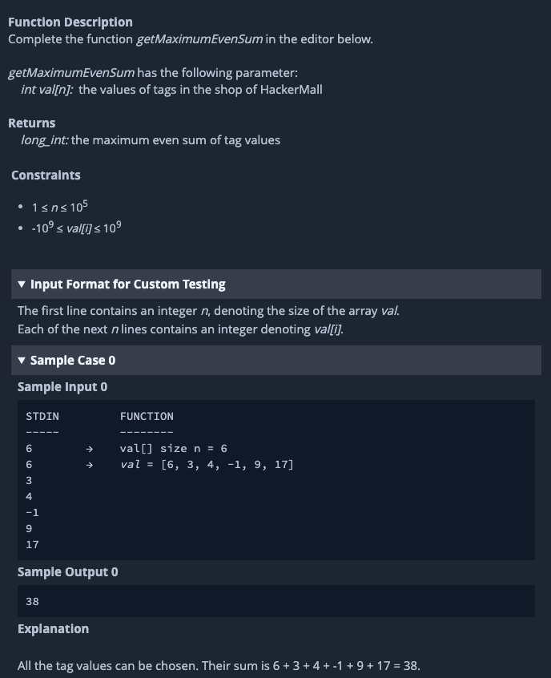

# Ejercicio de lógica par mayor en conjunto de números.

### Descripción y Procedimiento

En resumen este ejercicio tiene objetivo obtener el par más alto de la suma de los números de un arreglo, para este ejercicio consideré 2 intentos de solución.

1. Observe que el primer intento a pesar de que está muy cercano a cumplir con todos los tests, no considera a todas las combinaciones de los elementos del arreglo por eso realice un intent número 2. 
   1. Para esta caso primero, separe todos los positivos y negativos del arreglo
   2. Después sume todos los elementos positivos
   3. A continuación verifique si era par para retornar el valor, en caso contrario comencé a reducir de la suma cada valor negativo
   4. Compare cada elemento negativo y retorne el par mayor

2. Decidí obtener todas las combinaciones de números del arreglo
   1. Mediante una serie de for combinados logré crear un arreglo de arreglos de todas las combinaciones númericas del arreglo
   2. De cada elemento de este arreglo, obtuve su suma.
   3. Identifique si dicha suma era par
   4. Del arreglo final de pares obtuve el mayor de los números, el cual retorne

### Como ejecutar

1. Instale NodeJS
2. Abra su terminal en la carpeta /path/to/folder/test-solved/Q1
3. Ejecute $ node index.js

## Instrucciones de HackerRank

