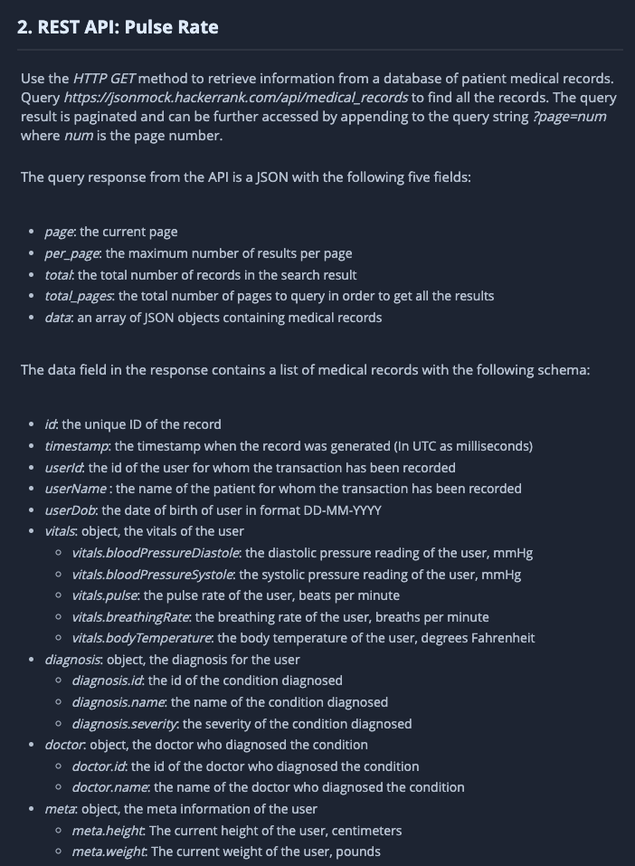
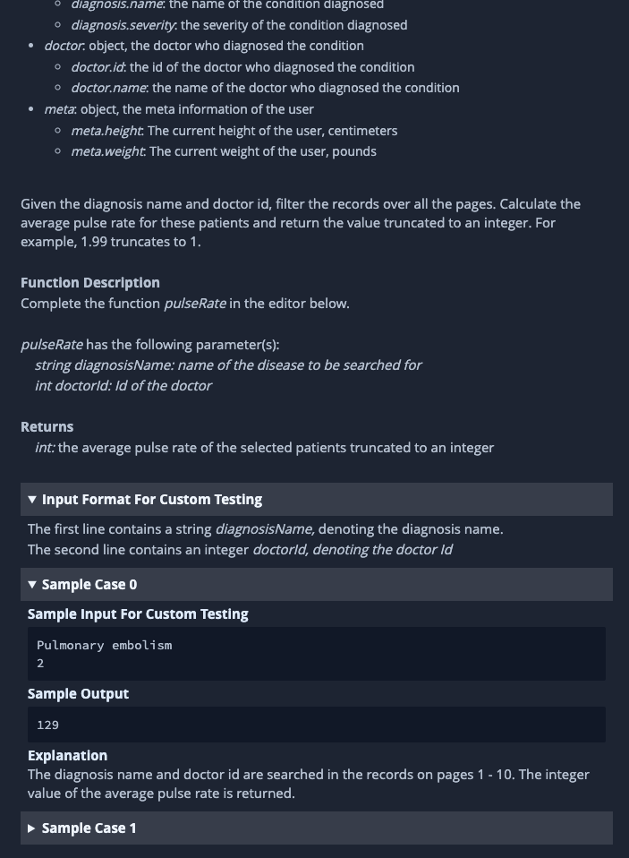
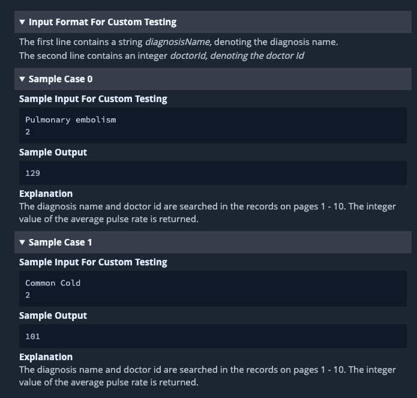

# Consumir una API.

### Descripción y Procedimiento

En resumen este ejercicio tiene objetivo obtener datos de una api a través del method HTTP GET, la cual se encuentra
paginada, y devolver el promedio de pulsaciones para los pacientes de un doctor y su diagnóstico.

#### Nota:

Ya que el ejercicio anterior consumió mucho de mi tiempo determinando e identificando el error en HackerRank,
durante los últimos minutos de la prueba solo alcance a extraer la información, y monte mi propia API con express y
mongoose con la
finalidad de demostrar el conocimiento en ambos aspectos además de resolver el problema solicitado.

1. Extraje la información completa de HackerRank => [Ver](./rawDataRequests.js)
2. Cree con ayuda de ExpressJS y mongoose la API (Modelos, Controller, Routes) con estructuras completas que sirvieren a dicha información. => [Ver](./API/)
3. Cree el script que inicializar la carga del RAW data a la API generada
4. Resolví la actividad de ejercicio 

### Como ejecutar

1. Instale NodeJS y NPM o Yarn
2. Abra su terminal en la carpeta /path/to/folder/test-solved/Q2/API
3. Ejecute $ npm i
4. Ejecute $ npm run server

5. Abra su terminal en la carpeta /path/to/folder/test-solved/Q2/test
6. Ejecute $ npm i
7. Ejecute $ npm start

## Instrucciones de HackerRank

