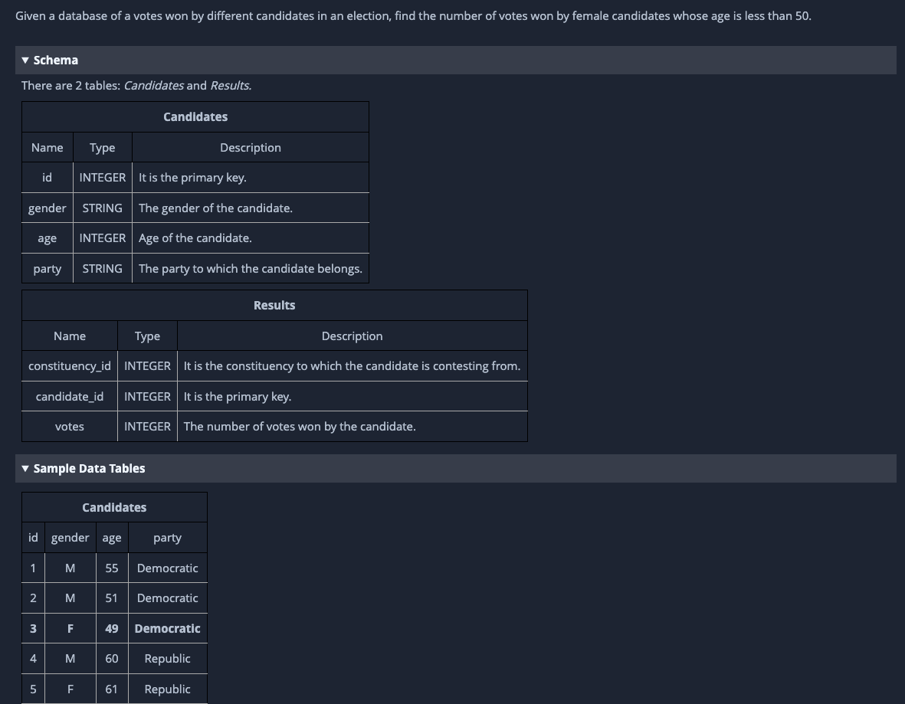
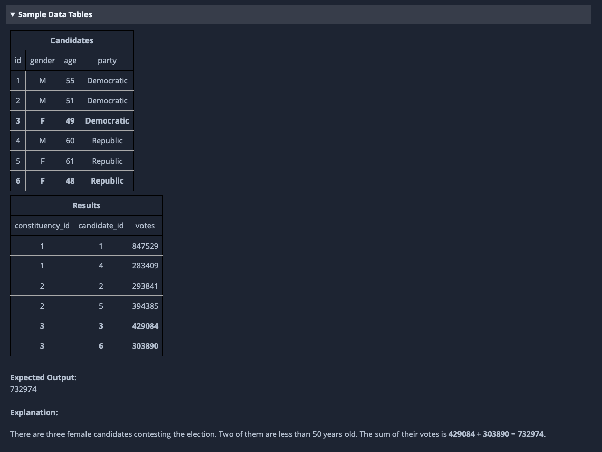
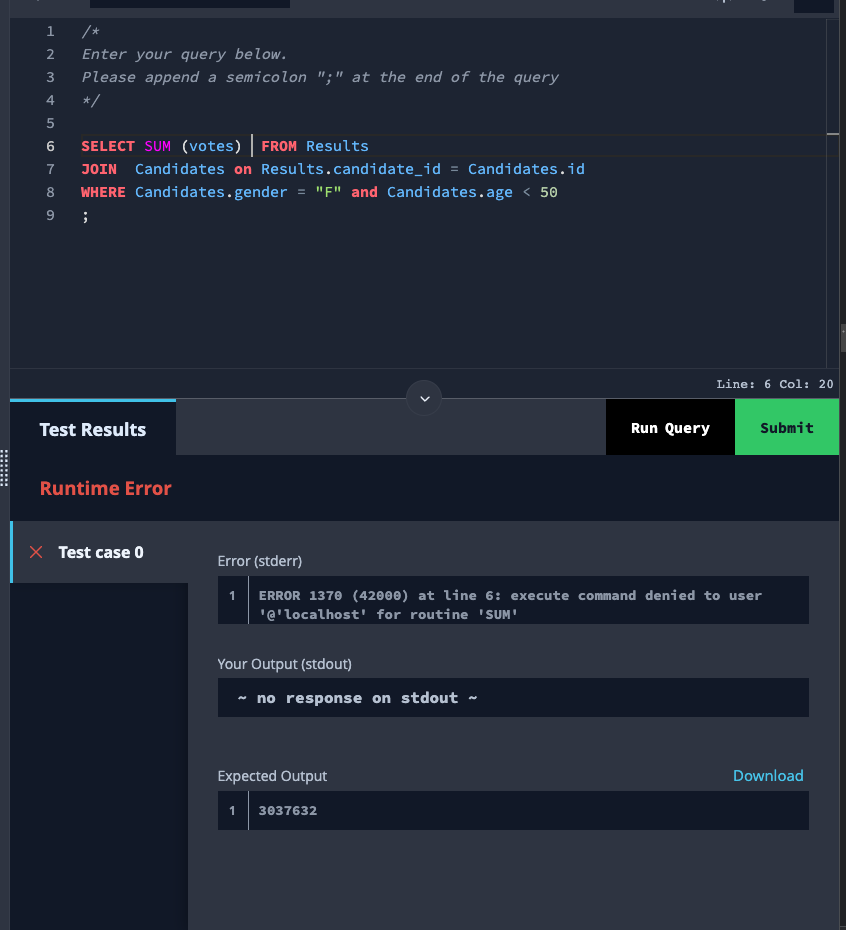
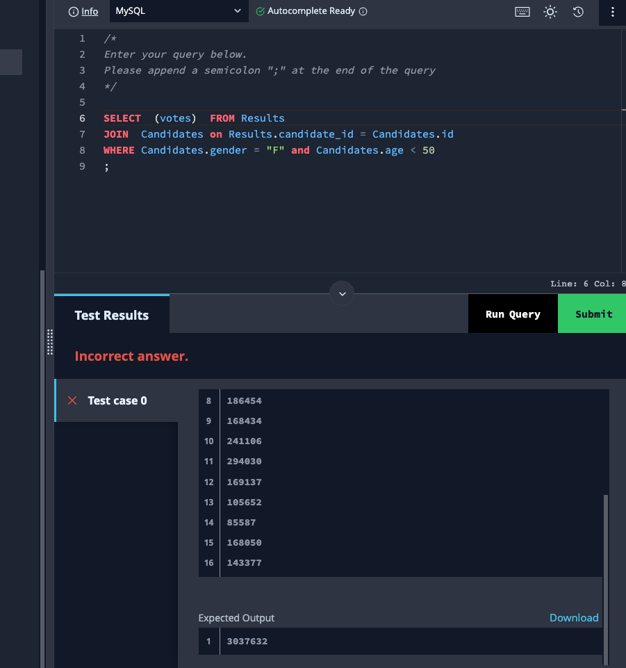
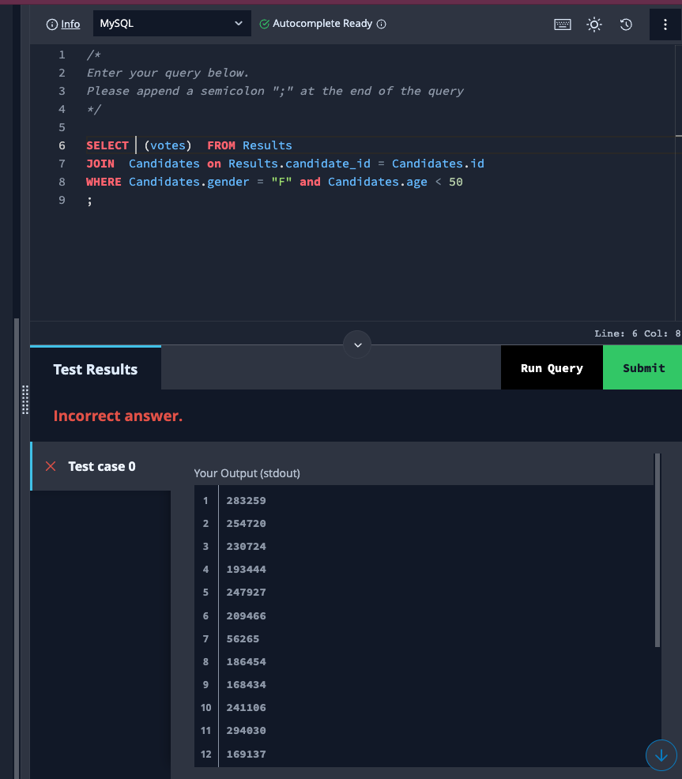
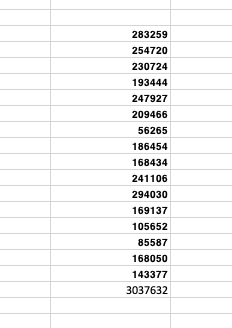

# Consulta con suma a base de datos MySql.

### Descripción y Procedimiento

En resumen este ejercicio tiene objetivo obtener la suma de los votos de las candidatas mujeres en el cual su edad sea
menor a 50

#### Nota:

La plataforma HackerRank fallo al realizar la suma marcando un error que no logre solventar, sin embargo, pude obtener
los datos de la consulta, y demostrar que realicé el procedimiento correcto.
En las capturas se muestra el error y el procedimiento asi como la comprobación de la suma y el resultado con ayuda de
excel

1. Realice la union de las tablas Results y Candidates
2. Utilice para la union los campos Results.candidate_id y Candidates.id
3. filtre a los candidatos femeninos mediante el campo Candidates.gender y la edad con Candidates.age
4. Seleccione solo el campo votos
5. Al intentar aplicar la suma la plataforma fallo

Como alternativa extraje los valores ya filtrados de la lista y los copie a excel para realizar de una forma
semi-automática la suma y mi resultado due igual al esperado por la plataforma

## Capturas

